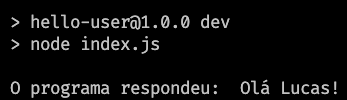

## Run C++ with NodeJS

___

### Links

> Article LinkedIn: https://www.linkedin.com/pulse/native-addons-como-incorporar-c%C3%B3digo-cc-em-aplica%C3%A7%C3%B5es-lucas-candido/

> Node.js Documentation: https://nodejs.org/docs/latest/api/addons.html